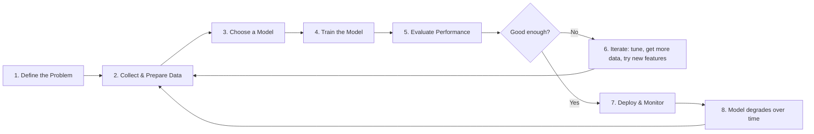
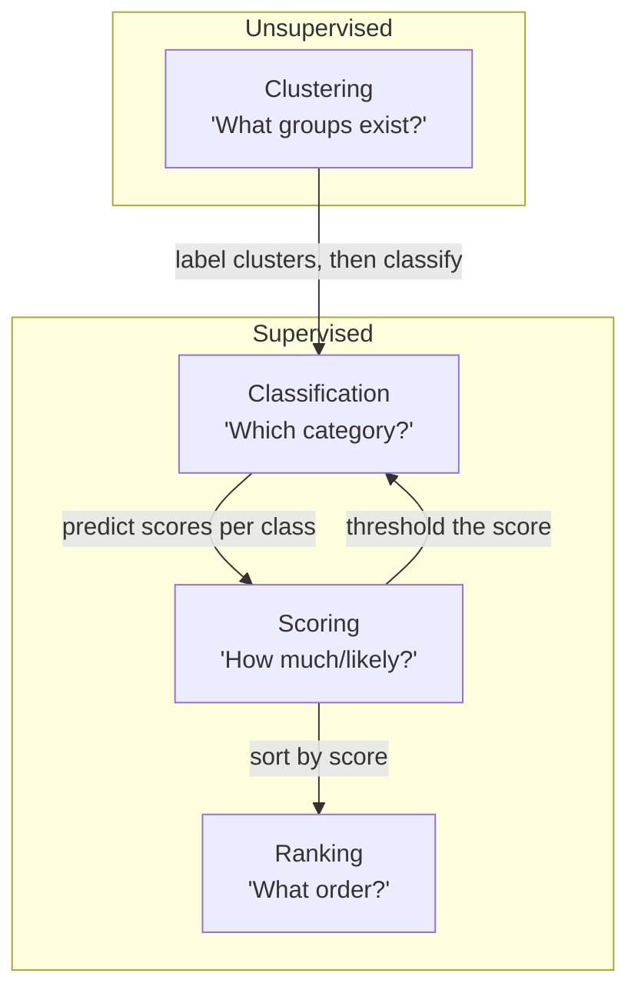

# Week 2: ML Foundations — When ML Wins, and When a Simple Rule Is Better

## Table of Contents
1. [Core Idea First, No AI](#1-core-idea-first-no-ai)
2. [AI vs ML vs Analytics vs Rules](#2-ai-vs-ml-vs-analytics-vs-rules)
3. [The ML Loop](#3-the-ml-loop)
4. [Supervised vs Unsupervised Learning](#4-supervised-vs-unsupervised-learning)
5. [Generalization vs Overfitting](#5-generalization-vs-overfitting-why-models-that-memorize-fail)
6. [ML Task Types: Classification, Clustering, Ranking & Scoring](#6-ml-task-types)
7. [Framing a Search Problem as an ML Task — Capstone Piece #1](#7-framing-your-search-problem-as-an-ml-task)

---

## 1. Core Idea First, No AI

Before reaching for machine learning, ask one question:

> **"Can I write down the rule?"**

If you can express the decision as a clear, static condition — **use the rule**. Rules are transparent, instant, free to run, and trivial to debug.

| Scenario | Rule works? | Why |
|---|---|---|
| Block orders from embargoed countries | ✅ Yes | The list is short, static, and legally defined |
| Detect spam emails | ❌ No | Spammers constantly change tactics; static keywords fail fast |
| Convert Celsius to Fahrenheit | ✅ Yes | It's a fixed formula: `F = C × 9/5 + 32` |
| Recommend the next video to watch | ❌ No | Depends on millions of user behaviors, context, and content features |

**The core insight:** ML earns its place when the decision surface is *too complex, too dynamic, or too high-dimensional* for a human to write down as explicit rules.

---

## 2. AI vs ML vs Analytics vs Rules

These terms are often used interchangeably, but they are *distinct layers* with different purposes:

```
┌─────────────────────────────────────────────────┐
│              Artificial Intelligence (AI)        │
│  "Machines that exhibit intelligent behavior"    │
│                                                  │
│   ┌─────────────────────────────────────────┐    │
│   │        Machine Learning (ML)            │    │
│   │  "Systems that learn patterns from      │    │
│   │   data without being explicitly         │    │
│   │   programmed for each case"             │    │
│   │                                         │    │
│   │   ┌─────────────────────────────────┐   │    │
│   │   │      Deep Learning (DL)         │   │    │
│   │   │  "Neural networks with many     │   │    │
│   │   │   layers (LLMs live here)"      │   │    │
│   │   └─────────────────────────────────┘   │    │
│   └─────────────────────────────────────────┘    │
└─────────────────────────────────────────────────┘
```

### The Four Approaches Compared

| Approach | What it does | Input | Output | Example |
|---|---|---|---|---|
| **Rules** | Execute fixed human-written logic | Conditions | Deterministic action | "If cart > $50, free shipping" |
| **Analytics** | Describe & summarize what happened | Historical data | Dashboards, reports, KPIs | "Bounce rate was 42% last month" |
| **Machine Learning** | Learn patterns from data to *predict* or *decide* | Labeled or unlabeled data | Predictions, scores, clusters | "This user has 73% probability of churning" |
| **AI (broad)** | Any system mimicking human intelligence | Varies | Varies | Chatbots, robotics, self-driving cars |

### When to use which?

```
Problem complexity ──────────────────────────────────▶

 RULES            ANALYTICS          ML              DEEP LEARNING / LLMs
 ─────            ─────────          ──              ────────────────────
 • Few conditions  • Summarize past   • Patterns too   • Unstructured data
 • Static logic    • Slice & dice     complex to       (text, images, audio)
 • Known edge      • Dashboards       hand-code       • Requires massive
   cases           • "What happened?" • Needs to        training data
                                       generalize to  • Transfer learning
                                       unseen data      valuable
```

> [!IMPORTANT]
> **Key takeaway:** ML is NOT a replacement for rules or analytics. It's a tool you reach for when the pattern is too complex to hand-code and you have enough data for the model to learn it.

---

## 3. The ML Loop

Machine learning is *not* a one-shot process. It's an iterative loop:



### Each step explained:

| Step | What happens | Search example |
|---|---|---|
| **1. Define the Problem** | Frame a clear question with a measurable target | "Which search results should rank higher for a given query?" |
| **2. Collect & Prepare Data** | Gather labeled examples, clean them, split into train/test | Collect query-click logs; label relevant vs. irrelevant results |
| **3. Choose a Model** | Pick an algorithm appropriate for the task | Logistic regression for binary relevance, or LambdaMART for ranking |
| **4. Train** | Feed training data to the model so it learns patterns | Model learns that clicks + dwell time correlate with relevance |
| **5. Evaluate** | Measure performance on *held-out* test data | Check precision@10, NDCG, or MRR on queries the model hasn't seen |
| **6. Iterate** | Improve features, tune hyperparameters, fix data issues | Add query-document similarity features; remove noisy labels |
| **7. Deploy & Monitor** | Put the model into production; watch for drift | Serve live rankings; track click-through rate daily |
| **8. Retrain** | Data changes over time; the model becomes stale | Retrain monthly on fresh query logs |

> [!TIP]
> The ML loop is *continuous*. A model in production is never "done" — user behavior changes, content changes, and the world changes. This is called **concept drift**, and it's why monitoring and retraining are essential.

---

## 4. Supervised vs Unsupervised Learning

These are the two fundamental paradigms of ML:

### Supervised Learning — "Learning with a teacher"

You have **labeled data** — each example comes with the correct answer.

```
Input (Features)              →  Label (Target)
─────────────────                ──────────────
[email text, sender, links]   →  spam / not spam
[query, document features]    →  relevant / not relevant
[house sqft, bedrooms, zip]   →  price ($425,000)
```

**The model learns the mapping:** `f(features) → label`

| Task Type | Label Type | Examples |
|---|---|---|
| **Classification** | Discrete category | Spam detection, image recognition, sentiment analysis |
| **Regression** | Continuous number | Price prediction, temperature forecasting, ad bid estimation |

### Unsupervised Learning — "Learning without a teacher"

You have **no labels** — the model discovers hidden structure on its own.

```
Input (Features)              →  ???
─────────────────                ───
[user browsing behavior]      →  discovers 4 natural user segments
[search queries]              →  groups similar queries together
[product descriptions]        →  finds topic clusters
```

| Task Type | What it finds | Examples |
|---|---|---|
| **Clustering** | Natural groups in data | Customer segmentation, query grouping, anomaly detection |
| **Dimensionality Reduction** | Simplified representations | PCA for visualization, embeddings |
| **Association** | Items that co-occur | "Customers who bought X also bought Y" |

### Side-by-side comparison

| Aspect | Supervised | Unsupervised |
|---|---|---|
| **Data requirement** | Labeled examples (expensive to create) | Raw data (cheaper, more abundant) |
| **Goal** | Predict a known target | Discover hidden patterns |
| **Evaluation** | Clear metrics (accuracy, F1, RMSE) | Harder to evaluate (silhouette score, human judgment) |
| **Risk** | Needs high-quality labels | May find meaningless patterns |
| **Search example** | "Is this result relevant to the query?" | "What types of queries do users ask?" |

> [!NOTE]
> There's also **semi-supervised** learning (small amount of labeled + large amount of unlabeled data) and **reinforcement learning** (agent learns through trial-and-error rewards). But supervised and unsupervised are the foundations.

---

## 5. Generalization vs Overfitting — Why Models That Memorize Fail

This is perhaps the *most important* concept in all of ML.

### The problem

```
                    Model Complexity →

  Error │
        │ ╲                          ╱
        │   ╲   Training error     ╱
        │     ╲                  ╱
        │       ╲──────────────╱     ← Test error (what matters)
        │         ╲          ╱
        │           ╲      ╱
        │             ╲  ╱
        │              ╲╱  ← Sweet spot
        │             ╱  ╲
        │           ╱      ╲
        │         ╱          ╲──── Training error keeps dropping
        │       ╱
        │     ╱
        └──────────────────────────────
        UNDERFIT    GOOD FIT    OVERFIT
```

### Three scenarios

| | Underfitting | Good Fit | Overfitting |
|---|---|---|---|
| **Training accuracy** | Low | High | Very high (≈100%) |
| **Test accuracy** | Low | High (close to training) | Low (big gap from training) |
| **The model** | Too simple; misses patterns | Captures real patterns | Memorized noise in training data |
| **Analogy** | A student who didn't study | A student who understood concepts | A student who memorized answers but can't solve new problems |

### Why does overfitting happen?

1. **Too little data** — The model doesn't see enough variety
2. **Too complex a model** — The model has more capacity than the data warrants
3. **Training too long** — The model starts fitting noise after learning signal
4. **Noisy labels** — Errors in the training data are treated as truth

### Why it matters for real-world systems

> [!CAUTION]
> **A model that memorizes its training data will fail catastrophically on new, real-world inputs.** This is why we always evaluate on held-out test data that the model has *never* seen during training.

**Search example:** Imagine training a relevance model only on queries from January. If user behavior shifts in February (seasonal trends, news events, new products), the overfitted model will make bad predictions because it memorized January's patterns rather than learning the *underlying* concept of relevance.

### Defenses against overfitting

| Technique | How it helps |
|---|---|
| **Train/Test Split** | Evaluate on data the model hasn't seen |
| **Cross-Validation** | Multiple train/test splits for more robust estimates |
| **Regularization** | Penalize overly complex models (L1, L2, dropout) |
| **More data** | Harder to memorize a larger, more diverse dataset |
| **Early stopping** | Stop training when test performance starts degrading |
| **Simpler model** | Sometimes a linear model beats a deep neural network |

---

## 6. ML Task Types

Every ML problem maps to one of a few core task types. For search and SEO applications, these four are the most relevant:

### Classification
> **Question:** "Which category does this belong to?"

- **Output:** A discrete label (binary or multi-class)
- **Examples:**
  - Is this page relevant or irrelevant to the query? → Binary classification
  - Is user intent navigational, informational, or transactional? → Multi-class classification
  - Is this content spam? → Binary classification
- **Metrics:** Accuracy, Precision, Recall, F1-score, AUC-ROC

### Clustering
> **Question:** "What natural groups exist in this data?"

- **Output:** Group assignments (no predefined labels)
- **Examples:**
  - Group search queries by user intent patterns
  - Segment website visitors by behavior
  - Identify content topic clusters for SEO strategy
- **Metrics:** Silhouette score, within-cluster sum of squares, human evaluation

### Ranking
> **Question:** "In what order should these items appear?"

- **Output:** An ordered list from most to least relevant/important
- **Examples:**
  - Rank search results for a query
  - Rank pages for internal linking priority
  - Rank keywords by opportunity score
- **Metrics:** NDCG (Normalized Discounted Cumulative Gain), MRR (Mean Reciprocal Rank), MAP (Mean Average Precision)

### Scoring
> **Question:** "How strong/likely/important is this?"

- **Output:** A continuous numerical score
- **Examples:**
  - Predict click-through rate for a search result
  - Score page authority (0–100)
  - Predict probability of conversion after landing
- **Metrics:** RMSE, MAE, R², calibration plots

### How they connect



> [!TIP]
> Scoring is often the foundation. If you can score items, you can rank them (sort by score) or classify them (apply a threshold). This is why many production systems start with a scoring model.

---

## 7. Framing Your Search Problem as an ML Task — Capstone Piece #1

This is where theory meets your capstone. To frame *your* search question as an ML task, fill in this template:

### The ML Task Frame

```
┌─────────────────────────────────────────────────────────────┐
│                    MY ML TASK FRAME                         │
├─────────────────────────────────────────────────────────────┤
│                                                             │
│  SEARCH QUESTION:                                          │
│  "________________________________________________"        │
│                                                             │
│  ML TASK TYPE:  □ Classification                           │
│                 □ Clustering                                │
│                 □ Ranking                                   │
│                 □ Scoring                                   │
│                                                             │
│  TARGET (what I'm predicting):                             │
│  "________________________________________________"        │
│                                                             │
│  INPUT FEATURES (what the model sees):                     │
│  • ____________________________________________            │
│  • ____________________________________________            │
│  • ____________________________________________            │
│                                                             │
│  SUCCESS METRIC (how I know the model works):              │
│  "________________________________________________"        │
│                                                             │
│  WHY NOT A RULE? (justification for ML):                   │
│  "________________________________________________"        │
│                                                             │
└─────────────────────────────────────────────────────────────┘
```

### Worked example: "Which blog posts will rank on page 1 of Google?"

| Component | Value |
|---|---|
| **Search Question** | "Given a blog post and a target keyword, will it rank in the top 10 of Google?" |
| **ML Task Type** | **Classification** (binary: page 1 vs. not page 1) |
| **Target** | `rank_page_1` — binary label (1 = top 10, 0 = not top 10) |
| **Input Features** | Word count, domain authority, number of backlinks, keyword density, content freshness, page speed score, internal link count |
| **Success Metric** | **F1-score ≥ 0.70** on held-out test set (balanced between precision and recall because both false positives and false negatives are costly) |
| **Why not a rule?** | There's no single threshold (e.g., "word count > 2000") that reliably predicts ranking. It depends on a complex interaction of 200+ ranking factors that vary by query intent, competition, and domain. |

### Another example: "How should I prioritize my keyword opportunities?"

| Component | Value |
|---|---|
| **Search Question** | "Given a set of keywords I could target, which ones should I write about first?" |
| **ML Task Type** | **Scoring** → then **Ranking** (score each keyword, then sort) |
| **Target** | `opportunity_score` — continuous value (0–100) combining search volume, difficulty, and business relevance |
| **Input Features** | Monthly search volume, keyword difficulty, current rank (if any), CPC, content gap analysis, topical authority score |
| **Success Metric** | **NDCG@10 ≥ 0.75** — the top 10 recommended keywords should closely match what an expert SEO strategist would pick |
| **Why not a rule?** | Simple rules like "pick highest volume + lowest difficulty" ignore business relevance, topical clustering, and competitive dynamics. The trade-offs are multi-dimensional. |

---

## Key Takeaways

> [!IMPORTANT]
> ### What you should leave with:
> 1. **ML ≠ AI ≠ Analytics ≠ Rules** — each has its lane; use the simplest tool that works
> 2. **The ML loop is iterative** — define → collect → train → evaluate → improve → deploy → monitor → repeat
> 3. **Supervised learning needs labels; unsupervised learning finds structure** — your task type determines which you need
> 4. **Overfitting is the #1 enemy** — a model that memorizes training data will fail on real-world data; always evaluate on held-out test sets
> 5. **Every ML task has a type, a target, and a metric** — if you can't name these three things, you don't have an ML task yet
> 6. **Your capstone starts here** — frame your search question as a real ML task with a defensible success metric

---

## References & Further Reading

- **Session recording:** [FlyRank YouTube Channel](https://www.youtube.com/@flyrank)
- **Video material:** [Week 2 Session — Applied Search Intelligence](https://youtu.be/aTxLqzQ5Isg)
- Google Machine Learning Crash Course: [developers.google.com/machine-learning/crash-course](https://developers.google.com/machine-learning/crash-course)
- Scikit-learn documentation on [model evaluation metrics](https://scikit-learn.org/stable/modules/model_evaluation.html)
